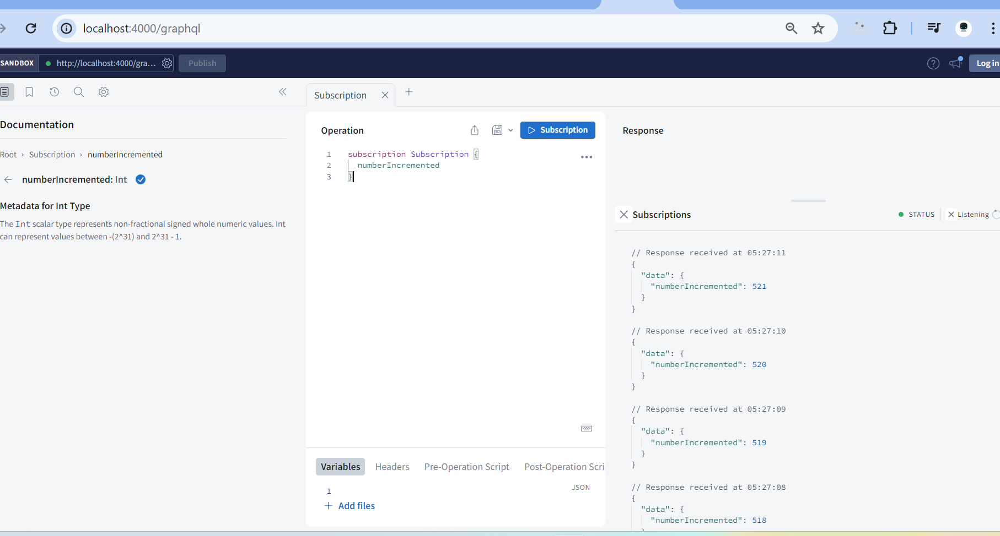

To start the application run, 

*yarn start*

Then access it via http://localhost:4000/graphql

You will need internet connection. 

Try to run this with grahq explorer. 

subscription Subscription {
  numberIncremented
}

Then you should be able to see this 

----

